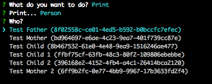

# Software Engineering Aufgabenblatt 7

Gruppe: S.H.I.E.L.D

## Setup

1. Unpack the enclosed zip files for "se7" or `git clone https://github.com/dodekeract/se-7`
2. Install node.js
3. Install npm (usually already installed by node)
4. Navigate to the unpacked folder (in terminal)
5. Install dependencies: `npm install`
6. Build: `npm run build`
7. Start: `npm run start`
8. Test: `npm run test`
